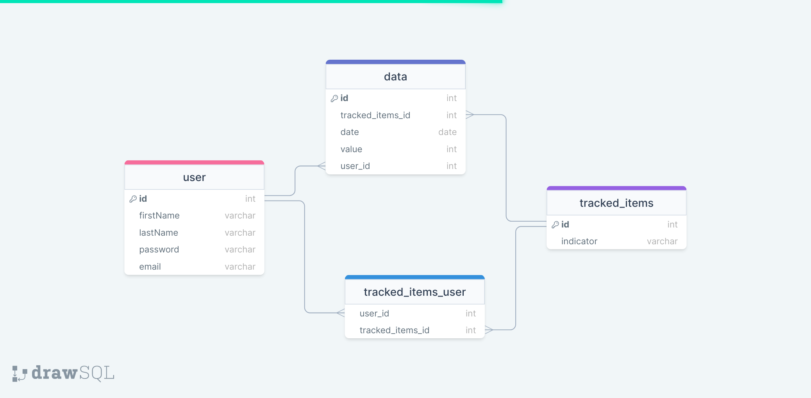
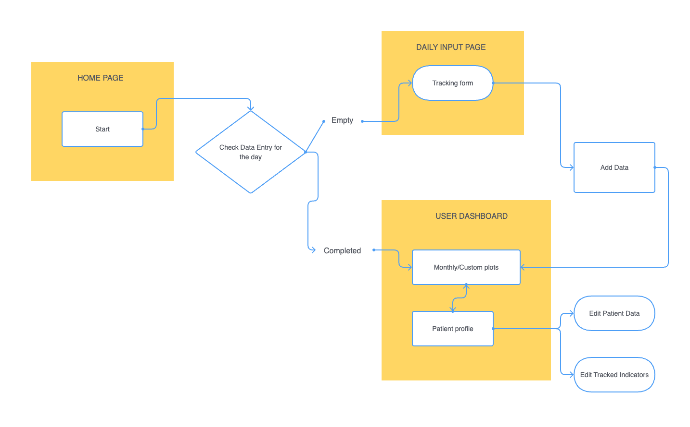

# Mind Connect
Mind Connect is a mental health tracker designed for patients who need to track specific mental-health indicators during the course of psychological or pharmaceutical interventions. The app provides better visualization than common paper-and pencil tracking methods, while giving the user the freedom to customize the indicators that they would like to track. 

Users can track mental health-related symptoms on a scale from 0 to 10 and visualize their evolution on a line graph.
Users can input their own mental health indicators and filter the plotted data based on month or by choosing a custom time frame.

In order to protect user information, authorization and authentication features are in place. Users must create a new account to start using this app and must log in to access, update and input their personal data.

## Getting started with Mind Connect
To create the database, run `npm run migrate` in the project folder. 

To install packages, run `npm install` in the project folder. Then, cd to the client folder and run again `npm install`.

To start the application, run `npm start` in the project folder. Then open another terminal window and run `npm start` again in the client folder.

## API routes
You can access a table describing all API routes [here](https://docs.google.com/document/d/1O1U_3h51VFvR2mhPNw2iAyywcwley3MX2vSJr88UJQ0/edit?usp=sharing)

## Database Schema

## User flow diagram

## Future features:
- Disable submit buttons if forms incomplete
- Different access for mental-health professionals
- Comments in progress view
- Notifications
- Include changes of medication in plot

_This is a student project that was created at [CodeOp](http://codeop.tech), a full stack development bootcamp in Barcelona._
